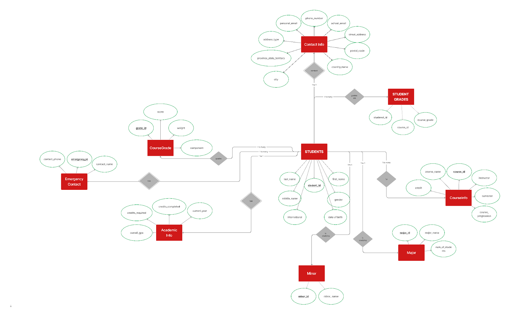

# StudentSphereDB - Student Record-Keeping Database

### Project Overview
StudentSphereDB is a student record-keeping database management system designed to handle and manage the complex and multi-faceted information of academic institutions. It simplifies data storage, access, and management for student records, grades, courses, and academic information.

### Problem Definition
Traditional record-keeping systems struggle to manage the high volume of complex student data. StudentSphereDB addresses this problem by providing a relational database solution that is efficient, adaptable, and easy to query, making it ideal for academic institutions.

## Database Structure

### Tables and Attributes
The database consists of the following tables, each serving a unique role in the management of student records:

- **Students**: Contains basic student information (e.g., `student_id`, `first_name`, `last_name`, `date_of_birth`, `major_id`, `minor_id`).
- **ContactInfo**: Stores contact details of the student (e.g., `student_id`, `school_email`, `personal_email`, `contact_number`, `address`, `city`).
- **EmergencyContact**: Maintains emergency contact information for students.
- **Major**: Lists all majors offered by the institution.
- **Minor**: Lists all minors offered by the institution.
- **AcademicInfo**: Contains details about the student’s academic status, including `current_year`, `credits_completed`, `overall_gpa`.
- **CourseInfo**: Stores details of courses available (e.g., `course_id`, `course_name`, `semester`, `credit_value`).
- **CourseGrade**: Contains grades for individual components within each course.
- **StudentGrades**: Contains overall grades for each course the student has completed.

### Entity-Relationship Diagram



### Dependencies and Relationships
1. **Students to Major**: One-to-Many (1:N)
2. **Students to Minor**: One-to-Many (1:N)
3. **Students to ContactInfo**: One-to-One (1:1)
4. **Students to EmergencyContact**: One-to-Many (1:N)
5. **AcademicInfo to Students**: One-to-One (1:1)
6. **Students to CourseInfo through CourseGrade**: Many-to-Many (M:N)
7. **Students to CourseInfo through StudentGrades**: Many-to-Many (M:N)

### Normalization
All entities and relationships are normalized up to 3NF, ensuring there are no data redundancies or anomalies.

## Setting Up the Database
1. **Install MySQL or use a compatible database**.
2. **Create the necessary tables** using the provided SQL schema.
3. **Insert demo data** to test the setup.

### Running the Queries
To test the database, use the following sample queries:

```sql
-- Display all student details:
SELECT * FROM Students;

-- View student contact information:
SELECT s.student_id, s.first_name, s.last_name, c.school_email, c.personal_email 
FROM Students s 
JOIN ContactInfo c ON s.student_id = c.student_id;

-- List all available courses:
SELECT * FROM CourseInfo;

-- Calculate a student’s GPA:
SELECT student_id, AVG(course_grade) AS gpa 
FROM StudentGrades 
WHERE student_id = 100007;

-- Show student majors and minors:
SELECT s.student_id, CONCAT(s.first_name, ' ', s.last_name) AS full_name, mj.major_name, mn.minor_name 
FROM Students s 
LEFT JOIN Major mj ON s.major_id = mj.major_id 
LEFT JOIN Minor mn ON s.minor_id = mn.minor_id;

-- Count students by major:
SELECT mj.major_name, COUNT(s.student_id) AS total_students 
FROM Students s 
JOIN Major mj ON s.major_id = mj.major_id 
GROUP BY mj.major_name;

-- Retrieve emergency contacts for all students:
SELECT s.student_id, CONCAT(s.first_name, ' ', s.last_name) AS student_name, ec.contact_name, ec.contact_phone 
FROM Students s 
JOIN EmergencyContact ec ON s.student_id = ec.student_id;
````
## Project Contributors
This project was created by the following team members as part of the CP363 Database course:

- **Sohan Hossain**
- **Zohib Ahmadi**
- **Prithvi Paturi**

## Future Scope and Improvements
The StudentSphereDB system has been designed with scalability and future improvements in mind. Future iterations could include:

- Integration with a web-based interface for easier interaction.
- Adding support for additional entities, such as faculty and departments.
- Implementing role-based access control for security.

## Final Thoughts
The StudentSphereDB project has provided hands-on experience in database design and management, including creating relational models, implementing normalization, and handling complex relationships. It serves as a robust solution for academic institutions to efficiently manage student data and is a foundational step towards more sophisticated academic record-keeping systems.
